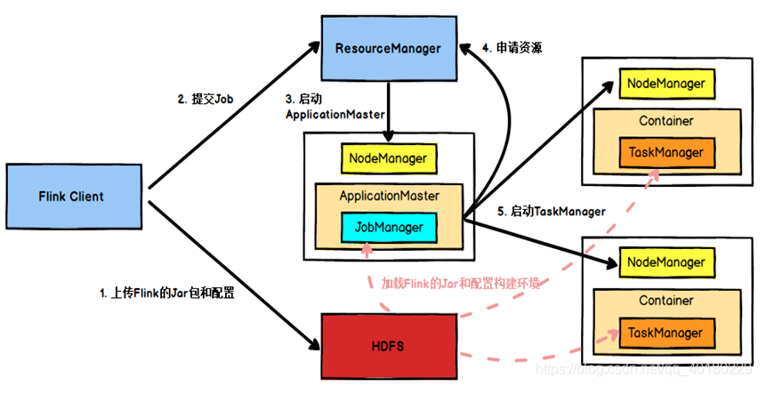
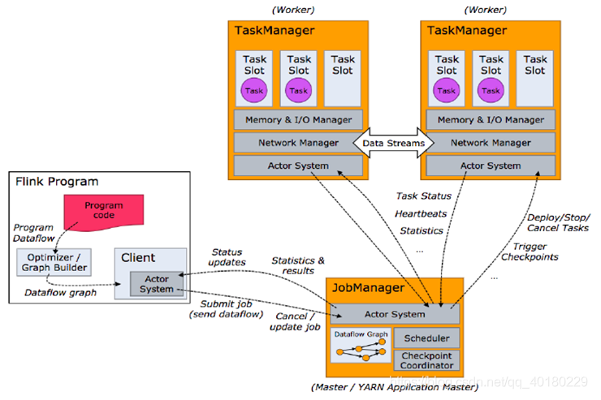
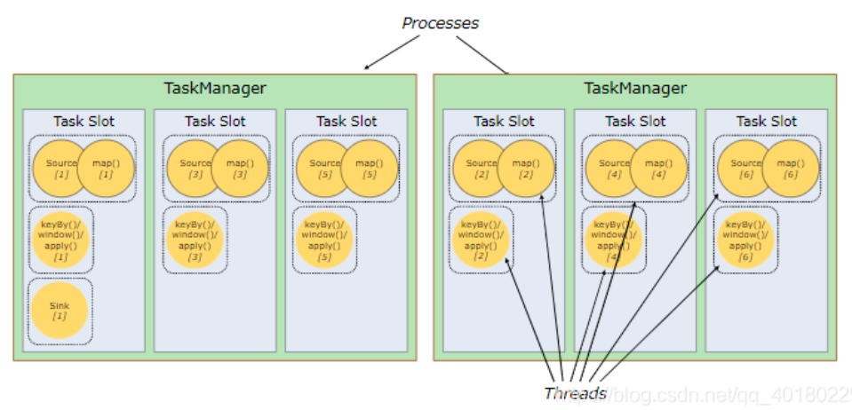
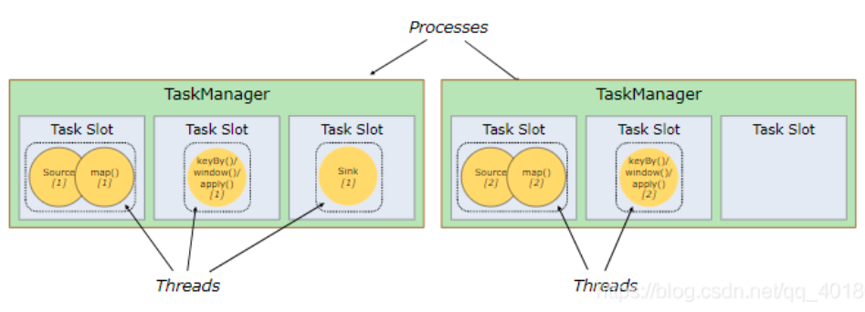
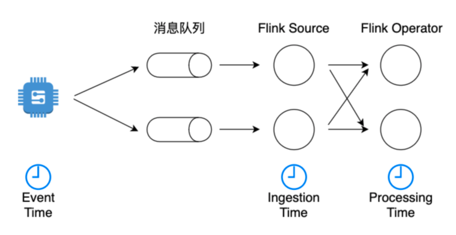
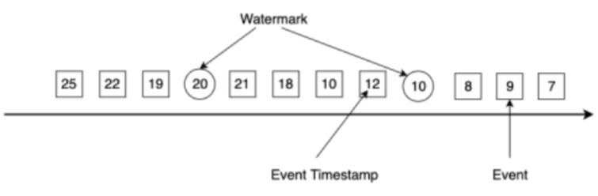
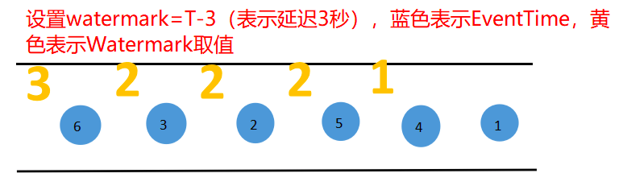
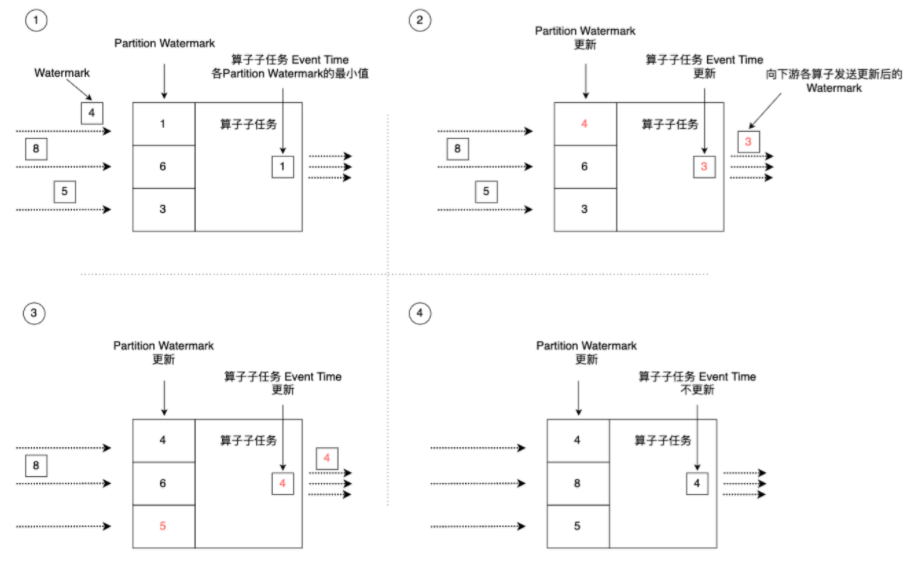

# Flink

## 1 特点
- 事件驱动（Event-driven）
- 基于流处理，一切皆由流组成，离线数据是有界的流；实时数据是一个没有界限的流。（有界流、无界流）

## 2 Flink vs Spark Streaming
- 数据模型<br>
Spark采用RDD模型，spark streaming的DStream实际上也就是一组组小批数据RDD的集合<br>
flink基本数据模型是数据流，以及事件（Event）序列<br>
- 运行时架构<br>
spark是批计算，将DAG划分为不同的stage，一个完成后才可以计算下一个<br>
flink是标准的流执行模式，一个事件在一个节点处理完后可以直接发往下一个节点处理<br>

## 3 任务提交

```./flink run -c com.atguigu.wc.StreamWordCount FlinkTutorial-1.0-SNAPSHOT-jar-with-dependencies.jar --host lcoalhost –port 7777```

**任务提交流程**


1. Flink任务提交后，Client向HDFS上传Flink的Jar包和配置
2. 之后客户端向Yarn ResourceManager提交任务，ResourceManager分配Container资源并通知对应的NodeManager启动ApplicationMaster
3. ApplicationMaster启动后加载Flink的Jar包和配置构建环境，去启动JobManager，之后JobManager向Flink自身的RM进行申请资源，自身的RM向Yarn 的ResourceManager申请资源(因为是yarn模式，所有资源归yarn RM管理)启动TaskManager
4. Yarn ResourceManager分配Container资源后，由ApplicationMaster通知资源所在节点的NodeManager启动TaskManager
5. NodeManager加载Flink的Jar包和配置构建环境并启动TaskManager，TaskManager启动后向JobManager发送心跳包，并等待JobManager向其分配任务。

## 4 运行原理
### 4.1 任务调度原理


1. 客户端不是运行时和程序执行的一部分，但它用于准备并发送dataflow(JobGraph)给Master(JobManager)，然后，客户端断开连接或者维持连接以等待接收计算结果。而Job Manager会产生一个执行图(Dataflow Graph)
2. 当 Flink 集群启动后，首先会启动一个 JobManger 和一个或多个的 TaskManager。由 Client 提交任务给 JobManager，JobManager 再调度任务到各个 TaskManager 去执行，然后 TaskManager 将心跳和统计信息汇报给 JobManager。TaskManager 之间以流的形式进行数据的传输。上述三者均为独立的 JVM 进程。
3. Client 为提交 Job 的客户端，可以是运行在任何机器上（与 JobManager 环境连通即可）。提交 Job 后，Client 可以结束进程（Streaming的任务），也可以不结束并等待结果返回。
4. JobManager 主要负责调度 Job 并协调 Task 做 checkpoint，职责上很像 Storm 的 Nimbus。从 Client 处接收到 Job 和 JAR 包等资源后，会生成优化后的执行计划，并以 Task 的单元调度到各个 TaskManager 去执行。
5. TaskManager 在启动的时候就设置好了槽位数（Slot），每个 slot 能启动一个 Task，Task 为线程。从 JobManager 处接收需要部署的 Task，部署启动后，与自己的上游建立 Netty 连接，接收数据并处理。

>注：如果一个Slot中启动多个线程，那么这几个线程类似CPU调度一样共用同一个slot

### 4.2 Slots和并行度



flink中的Slot可以理解为spark中的executor<br>
是否分组的区别就在于，同一个链路上前后不同的算子能否公用一个Slot，默认是可以的，如果设置了分组就不能公用会像上面图二一样全部摊平。<br>
正常情况下，采用默认不设置分组，各个数据链路互不影响，健壮性更高，同时资源使用更均衡。
Slot的多少决定了并行度的多少，并行度决定了处理task的快慢，但是要合理设置，整体类似spark并行度的概念。

## 5 watermark机制
### 5.1 时间语义

- Event Time：事件创建事件，往往更关心事件时间(Event Time)
- Ingestion Time：涉入时间，数据进入Flink的时间
- Processing Time：默认的，处理时间，执行操作算子的本地系统时间，与机器相关

### 5.2 watermark
由于网络、分布式等原因，生产的数据会乱序，如果以Event Time来处理数据且以简单的一个时间1来到就默认时间1之前的数据都已经到达，这样就会造成数据丢失、不准确的问题。<br>
此时就需要引入Watermark机制（是Flink插入到数据流中的一种特殊的数据结构，它包含一个时间戳，并假设后续不会有小于该时间戳的数据）<br>
特点
- Watermark与事件的时间戳紧密相关。一个时间戳为T的Watermark假设后续到达的事件时间戳都大于T。
- 假如Flink算子接收到一个违背上述规则的事件，该事件将被认定为迟到数据，如上图中时间戳为19的事件比Watermark(20)更晚到达。Flink提供了一些其他机制来处理迟到数据。
<br>
- Watermark时间戳必须单调递增，以保证时间不会倒流（已经到达数据的时间最大值，一般WaterMark设置比最大时间小一点，可以保证有点延迟）。
- Watermark机制允许用户来控制准确度和延迟。Watermark设置得与事件时间戳相距紧凑，会产生不少迟到数据，影响计算结果的准确度，整个应用的延迟很低；Watermark设置得非常宽松，准确度能够得到提升，但应用的延迟较高，因为Flink必须等待更长的时间才进行计算。
<br>
上图每次watermark的取值表示次之之前的数据已经到齐，可以关闭窗口。当WaterMark的取值为5时，表示0-5的窗口需要关闭，即可以进行计算输出。

### 5.3 并行传递
<br>
当上游某分区有Watermark进入该算子子任务后，Flink先判断新流入的Watermark时间戳是否大于Partition Watermark列表内记录的该分区的历史Watermark时间戳，如果新流入的更大，则更新该分区的Watermark。例如，某个分区新流入的Watermark时间戳为4，算子子任务维护的该分区Watermark为1，那么Flink会更新Partition Watermark列表为最新的时间戳4。接着，Flink会遍历Partition Watermark列表中的所有时间戳，选择最小的一个作为该算子子任务的Event Time。同时，Flink会将更新的Event Time作为Watermark发送给下游所有算子子任务。算子子任务Event Time的更新意味着该子任务将时间推进到了这个时间，该时间之前的事件已经被处理并发送到下游。例如，图中第二步和第三步，Partition Watermark列表更新后，导致列表中最小时间戳发生了变化，算子子任务的Event Time时钟也相应进行了更新。整个过程完成了数据流中的Watermark推动算子子任务Watermark的时钟更新过程。Watermark像一个幕后推动者，不断将流处理系统的Event Time向前推进。<br>

我们可以将这种机制总结为：
1. Flink某算子子任务根据各上游流入的Watermark来更新Partition Watermark列表。
2. 选取Partition Watermark列表中最小的时间作为该算子的Event Time，并将这个时间发送给下游算子。
这样的设计机制满足了并行环境下Watermark在各算子中的传播问题，但是假如某个上游分区的Watermark一直不更新，Partition Watermark列表其他地方都在正常更新，唯独个别分区的时间停留在很早的某个时间，这会导致算子的Event Time时钟不更新，相应的时间窗口计算也不会被触发，大量的数据积压在算子内部得不到处理，整个流处理处于空转状态。这种问题可能出现在使用数据流自带的Watermark，自带的Watermark在某些分区下没有及时更新。针对这种问题，一种解决办法是根据机器当前的时钟周期性地生成Watermark。<br>

此外，在union等多数据流处理时，Flink也使用上述Watermark更新机制，那就意味着，多个数据流的时间必须对齐，如果一方的Watermark时间较老，那整个应用的Event Time时钟也会使用这个较老的时间，其他数据流的数据会被积压。一旦发现某个数据流不再生成新的Watermark，我们要在SourceFunction中的SourceContext里调用markAsTemporarilyIdle设置该数据流为空闲状态。

### 5.4 乱序处理
- Watermark 的作用是防止 数据乱序 / 指定时间内获取不到全部数据。
- allowLateNess 是将窗口关闭时间再延迟一段时间。
- sideOutPut 是最后兜底操作，当指定窗口已经彻底关闭后，就会把所有过期延迟数据放到侧输出流，让用户决定如何处理。

例子<br>

假如我们设置10s的时间窗口（window），那么0-10s，10-20s都是一个窗口，以0-10s为例，0为start-time，10为end-time。<br>
假如有4个数据的event-time分别是8(A),12.5(B),9(C),13.5(D)，我们设置Watermarks为当前所有到达数据event-time的最大值减去延迟值3.5秒<br>
当A到达的时候，Watermarks为max{8}-3.5=8-3.5 = 4.5 < 10,不会触发计算<br>
当B到达的时候，Watermarks为max(12.5,8)-3.5=12.5-3.5 = 9 < 10,不会触发计算<br>
当C到达的时候，Watermarks为max(12.5,8,9)-3.5=12.5-3.5 = 9 < 10,不会触发计算<br>
当D到达的时候，Watermarks为max(13.5,12.5,8,9)-3.5=13.5-3.5 = 10 = 10,触发计算<br>
触发计算的时候，会将A，C（因为他们都小于10）都计算进去，其中C是迟到的。<br>
max这个很关键，就是当前窗口内，所有事件的最大事件。<br>
这里的延迟3.5s是我们假设一个数据到达的时候，比他早3.5s的数据肯定也都到达了，这个是需要根据经验推算。<br>
假设加入D到达以后有到达了一个E,event-time=6，但是由于0~10的时间窗口已经开始计算了，所以E就丢了。<br>
从这里上面E的丢失说明，水位线也不是万能的，但是如果根据我们自己的生产经验+侧道输出等方案，可以做到数据不丢失。<br>


