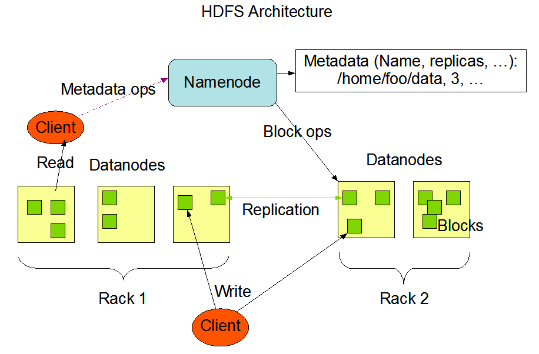
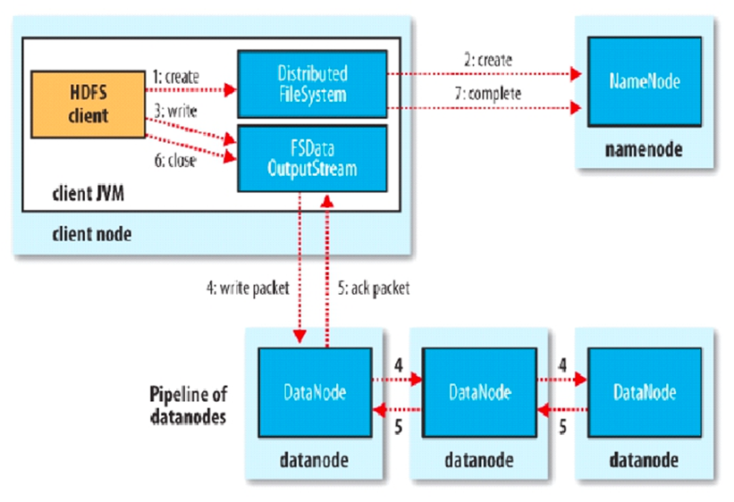
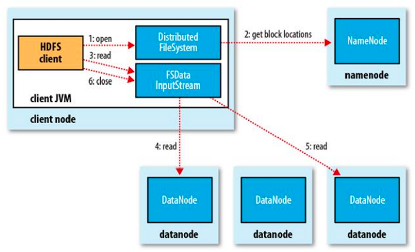

# Hdfs

## 1 简介
HDFS （Hadoop Distributed File System）是 Hadoop 下的分布式文件系统，具有高容错、高吞吐量等特性，可以部署在低成本的硬件上。

## 2 架构设计
> 主要由NameNode和DataNode构成。

### 2.1 NameNode主要功能
- 接受客户端的读写服务
- 收集DataNode汇报的Block列表信息
- NameNode保存metadata信息包括：文件owership、permissions、文件大小、时间、Block列表、Block偏移量和位置信息（副本位置由DataNode汇报，实时改变，不会持久化）等

**metadata信息基于内存存储，不会和磁盘发生交换，只存在内存中，但也有持久化的功能，只是单方向的存储，防止断电丢失，不会发生内存和磁盘的交换，NameNode的metadate信息在启动后会加载到内存，metadata存储到磁盘文件名为”fsimage”，Block的位置信息不会保存到fsimage，由DataNode汇报，“edits”记录对metadata的操作日志。**

### 2.2 DataNode主要功能
- 使用本地磁盘目录以文件形式存储数据（Block）
- 同时存储Block的元数据信息文件（校验和，用于检测数据块是否损坏了。客户端在读取到数据后md5和sha1校验）

**启动DN时会向NN汇报block信息，通过向NN发送心跳保持与其联系（3秒一次），如果NN 10分钟没有收到DN的心跳，则认为其已经lost，并copy其它DN上的block到新的DN。**

### 2.3 数据存放策略：

- 第一个副本：放置在上传文件的DN；如果是集群外提交，则随机挑选一台磁盘不太满，CPU不太忙的节点。
- 第二个副本：放置在于第一个副本不同的机架的节点上。
- 第三个副本：与第二个副本相同机架的节点。
- 更多副本：随机节点。

### 2.4 NameNode和DataNode的关系

为了保证整个集群的正常运行，namenode需要定期的点名。这里的namenode并不会主动点名，而是让各个datanode主动汇报，定期的给namenode发送信息。信息包括两部分，心跳检测（HeartBeat）和数据块汇报信息（BlockReport）。前者告诉namenode，datanode还活着；后者是该datanode上数据块的信息。
1. 如果HeartBeat和BlockReport被namenode收到了
namenode会汇总大家的blockreport，检测文件的数据块是否有丢失，数据块的复制数是否达到要求。如果没有达到要求，集群会进入Safe Mode。
2. 如果namenode超过10min还没有收到某个datanode的HeartBeat
namenode会将这个datanode标记为挂了，然后将原本存储在这个datanode上的数据块，重新复制到其他节点上，并且以后的计算任务也不会再发送给这个datanode了。

### 2.5 安全模式
namenode启动的时候，首先将映像文件(fsimage)载入内存，并执行编辑日志(edits)中的各项操作。一旦在内存中成功建立文件系统元数据的映射，则创建一个新的fsimage文件（这个操作不需要SecondaryNameNode）和一个空的编辑日志。此刻namenode运行在安全模式。即namenode的文件系统对于客服端来说是只读的（显示目录，显示文件内容等。写、删除、重命名都会失败）。在此阶段Namenode收集各个datanode的报告，当数据块达到最小副本数以上时，会被认为是“安全”的， 在一定比例（可设置）的数据块被确定为“安全”后，再过若干时间，安全模式结束。当检测到副本数不足的数据块时，该块会被复制直到达到最小副本数，系统中数据块的位置并不是由namenode维护的，而是以块列表形式存储在datanode中。

### 2.6 SecondaryNameNode
为了防止namedoe挂掉，增加SNN，它不是NN(namenode)的备份（但可以做备份），它的主要工作是帮助NN合并edits log，减少NN启动时间。SNN执行合并时机：根据配置文件设置的时间间隔fs.checkpoint.period，默认3600秒或者根据配置文件设置edits log大小fs.checkpoint.size规定edits文件的最大值，默认是64MB。

1. NN创建一个新的edits log来接替老的edits的工作
2. NN将fsimage和旧的edits拷贝到SNN上
3. SNN上进行合并操作，产生一个新的fsimage
4. 将新的fsimage复制一份到NN上
5. 使用新的fsimage和新的edits log

## 3 读写流程

### 3.1 写流程

1. 客户端创建DistributedFileSystem对象。
2. DistributedFileSystem对象调用元数据节点，在文件系统的命名空间中创建一个新的文件，元数据节点首先确定文件原来不存在，并且客户端有创建文件的权限，然后创建新文件，并标识为“上传中”状态，即可以看见，但不能使用。
3. DistributedFileSystem返回DFSOutputStream，客户端用于写数据。
4. 客户端开始写入数据，DFSOutputStream将数据分成块，写入data queue（Data queue由Data Streamer读取），并通知元数据节点分配数据节点，用来存储数据块（每块默认复制3块）。分配的数据节点放在一个pipeline里。Data Streamer将数据块写入pipeline中的第一个数据节点。第一个数据节点将数据块发送给第二个数据节点。第二个数据节点将数据发送给第三个数据节点。注意：并不是第一个数据节点完全接收完block后再发送给后面的数据节点，而是接收到一部分就发送，所以三个节点几乎是同时接收到完整的block的。DFSOutputStream为发出去的数据块保存了ack queue，等待pipeline中的数据节点告知数据已经写入成功。如果block在某个节点的写入的过程中失败：关闭pipeline，将ack queue放至data queue的开始。已经写入节点中的那些block部分会被元数据节点赋予新的标示，发生错误的节点重启后能够察觉其数据块是过时的，会被删除。失败的节点从pipeline中移除，block的其他副本则写入pipeline中的另外两个数据节点。元数据节点则被通知此block的副本不足，将来会再创建第三份备份。
5. ack queue返回成功。
6. 客户端结束写入数据，则调用stream的close函数，最后通知元数据节点写入完毕。
总结：
客户端切分文件Block，按Block线性地和NN获取DN列表（副本数），验证DN列表后以更小的单位流式传输数据，各节点两两通信确定可用，Block传输结束后，DN向NN汇报Block信息，DN向Client汇报完成，Client向NN汇报完成，获取下一个Block存放的DN列表，最终Client汇报完成，NN会在写流程更新文件状态。

### 3.2 读流程

1. 客户端(client)用FileSystem的open()函数打开文件。
2. DistributedFileSystem调用元数据节点，得到文件的数据块信息。对于每一个数据块，元数据节点返回保存数据块的数据节点的地址。
3. DistributedFileSystem返回FSDataInputStream给客户端，用来读取数据。
4. 客户端调用stream的read()函数开始读取数据（也会读取block的元数据）。DFSInputStream连接保存此文件第一个数据块的最近的数据节点（优先读取同机架的block）。
5. Data从数据节点读到客户端。当此数据块读取完毕时，DFSInputStream关闭和此数据节点的连接，然后连接此文件下一个数据块的最近的数据节点。
6. 当客户端读取完毕数据的时候，调用FSDataInputStream的close函数。
7. 在读取数据的过程中，如果客户端在与数据节点通信出现错误，则尝试连接包含此数据块的下一个数据节点。失败的数据节点将被记录，以后不再连接。
总结：
客户端和NN获取一部分Block（获取部分block信息，而不是整个文件全部的block信息，读完这部分block后，再获取另一个部分block的信息）副本位置列表，线性地和DN获取Block，最终合并为一个文件，在Block副本列表中按距离择优选取。

## 4 优缺点
优点
- 高容错性，数据自动保存多个副本，副本丢失后，自动恢复
- 适合批处理，移动计算而非数据，数据位置暴露给计算框架（Block偏移量）
- 适合大数据处理，GB 、TB 、甚至PB 级数据，百万规模以上的文件数量，10K+节点数量
- 可构建在廉价机器上
- 通过多副本提高可靠性，提供了容错和恢复机制

缺点
- 低延迟数据访问，HDFS不太适合于那些要求低延时（数十毫秒）访问的应用程序，因为HDFS是设计用于大吞吐量数据的，这是以一定延时为代价的。HDFS是单Master的，所有对文件的请求都要经过它，当请求多时，肯定会有延时
- 小文件存取时占用NameNode 大量内存，寻道时间超过读取时间
- 一个文件只能有一个写者，且仅支持append

## 5 文件格式

TextFile每一行都是一条记录，每行都以换行符（\ n）结尾。数据不做压缩，磁盘开销大，数据解析开销大。可结合Gzip、Bzip2使用（系统自动检查，执行查询时自动解压），但使用这种方式，hive不会对数据进行切分，从而无法对数据进行并行操作。
SequenceFile是Hadoop API提供的一种二进制文件支持，其具有使用方便、可分割、可压缩的特点。支持三种压缩选择：NONE, RECORD, BLOCK。 Record压缩率低，一般建议使用BLOCK压缩。
RCFile是一种行列存储相结合的存储方式。首先，其将数据按行分块，保证同一个record在一个块上，避免读一个记录需要读取多个block。其次，块数据列式存储，有利于数据压缩和快速的列存取。
AVRO是开源项目，为Hadoop提供数据序列化和数据交换服务。您可以在Hadoop生态系统和以任何编程语言编写的程序之间交换数据。Avro是基于大数据Hadoop的应用程序中流行的文件格式之一。
ORC文件代表了优化排柱状的文件格式。ORC文件格式提供了一种将数据存储在Hive表中的高效方法。这个文件系统实际上是为了克服其他Hive文件格式的限制而设计的。Hive从大型表读取，写入和处理数据时，使用ORC文件可以提高性能。
Parquet是一个面向列的二进制文件格式。Parquet对于大型查询的类型是高效的。对于扫描特定表格中的特定列的查询，Parquet特别有用。Parquet桌子使用压缩Snappy，gzip;目前Snappy默认。
- https://blog.csdn.net/panfelix/article/details/107270997
- https://blog.csdn.net/yu616568/article/details/51868447
