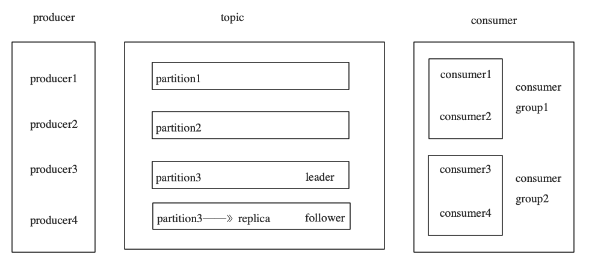

# Kafka

## 1 简介
kafka是一个分布式消息队列。具有高性能、持久化、多副本备份、横向扩展能力。生产者往队列里写消息，消费者从队列里取消息进行业务逻辑。Kafka就是一种发布-订阅模式。将消息保存在磁盘中，以顺序读写方式访问磁盘，避免随机读写导致性能瓶颈。

## 2 架构设计
 
- producer:消息生产者，发布消息到Kafka集群的终端或服务
- broker:Kafka集群中包含的服务器，一个borker表示kafka集群中的一个节点
- topic:每条发布到Kafka集群的消息属于的类别，即Kafka是面向 topic 的。更通俗的说Topic就像一个消息队列，生产者可以向其写入消息，消费者可以从中读取消息，一个Topic支持多个生产者或消费者同时订阅它，所以其扩展性很好。
- partition:每个 topic 包含一个或多个partition。Kafka分配的单位是partition
- replica:partition 的副本，保障 partition 的高可用。
- consumer:从Kafka集群中消费消息的终端或服务
- consumer group:每个 consumer 都属于一个 consumer group，每条消息只能被 consumer group 中的一个 Consumer 消费，但可以被多个 consumer group 消费。
- leader:每个partition有多个副本，其中有且仅有一个作为Leader，Leader是当前负责数据的读写的partition。 producer 和 consumer 只跟 leader 交互
- follower:Follower跟随Leader，所有写请求都通过Leader路由，数据变更会广播给所有Follower，Follower与Leader保持数据同步。如果Leader失效，则从Follower中选举出一个新的Leader。
- controller:知道大家有没有思考过一个问题，就是Kafka集群中某个broker宕机之后，是谁负责感知到他的宕机，以及负责进行Leader Partition的选举？如果你在Kafka集群里新加入了一些机器，此时谁来负责把集群里的数据进行负载均衡的迁移？包括你的Kafka集群的各种元数据，比如说每台机器上有哪些partition，谁是leader，谁是follower，是谁来管理的？如果你要删除一个topic，那么背后的各种partition如何删除，是谁来控制？还有就是比如Kafka集群扩容加入一个新的broker，是谁负责监听这个broker的加入？如果某个broker崩溃了，是谁负责监听这个broker崩溃？这里就需要一个Kafka集群的总控组件，Controller。他负责管理整个Kafka集群范围内的各种东西。
- zookeeper
1. Kafka 通过 zookeeper 来存储集群的meta元数据信息
2. 一旦controller所在broker宕机了，此时临时节点消失，集群里其他broker会一直监听这个临时节点，发现临时节点消失了，就争抢再次创建临时节点，保证有一台新的broker会成为controller角色。
-  offset:消费者在对应分区上已经消费的消息数（位置），offset保存的地方跟kafka版本有一定的关系。
1. kafka0.8 版本之前offset保存在zookeeper上。
2. kafka0.8 版本之后offset保存在kafka集群上。
- ISR机制
1. 光是依靠多副本机制能保证Kafka的高可用性，但是能保证数据不丢失吗？不行，因为如果leader宕机，但是leader的数据还没同步到follower上去，此时即使选举了follower作为新的leader，当时刚才的数据已经丢失了。
2. ISR是：in-sync replica，就是跟leader partition保持同步的follower partition的数量，只有处于ISR列表中的follower才可以在leader宕机之后被选举为新的leader，因为在这个ISR列表里代表他的数据跟leader是同步的。