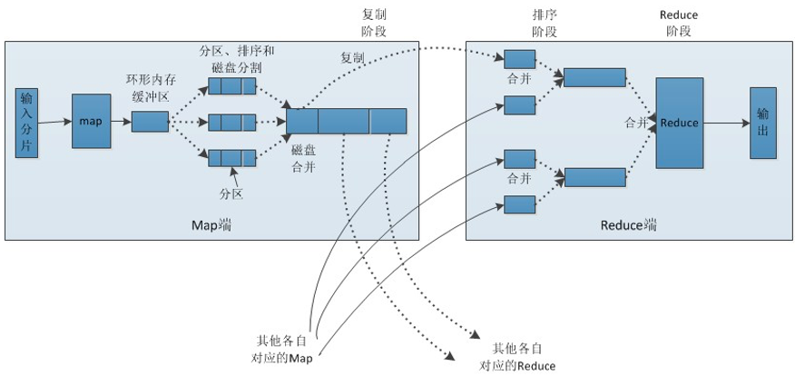

# MapReduce

## 1 原理


**要点**：
- Map：读懂数据、映射为KV模型、并行分布式、计算向数据移动
- Reduce：数据全量/分量加工、相同的Key汇聚到一个Reduce中、相同的Key调用一次reduce方法、Reduce中可以包含不同的key、排序实现key的汇聚
- K、V：使用自定义数据类型，作为参数传递，节省开发成本，提高程序自由度
- Writable序列化：分布式程序数据交互
- Comparable比较器：实现具体排序（字典序，数值序等）
- MapReduce任务中Shuffle和排序的过程

## 2 流程分析
### 2.1 map
1. 每个输入分片会让一个map任务来处理，默认情况下，以HDFS的一个块的大小（默认为64M）为一个分片，当然我们也可以设置块的大小。map输出的结果会暂且放在一个环形内存缓冲区中（该缓冲区的大小默认为100M，由io.sort.mb属性控制），当该缓冲区快要溢出时（默认为缓冲区大小的80%，由io.sort.spill.percent属性控制），会在本地文件系统中创建一个溢出文件，将该缓冲区中的数据写入这个文件。
2. 在写入磁盘之前，线程首先根据reduce任务的数目将数据划分为相同数目的分区，也就是一个reduce任务对应一个分区的数据。分区就是给数据打一个标签，让它被某个固定的reduce执行，这样做是为了避免有些reduce任务分配到大量数据，而有些reduce任务却分到很少数据，甚至没有分到数据的尴尬局面。其实分区就是对数据进行hash的过程。然后对每个分区中的数据进行排序，如果此时设置了Combiner，将排序后的结果进行combine操作，这样做的目的是让尽可能少的数据写入到磁盘。
3. 当map任务输出最后一个记录时，可能会有很多的溢出文件，这时需要将这些文件合并。合并的过程中会不断地进行排序和combine操作，目的有两个：1)尽量减少每次写入磁盘的数据量；2)尽量减少下一复制阶段网络传输的数据量。最后合并成了一个已分区且已排序的文件。为了减少网络传输的数据量，这里可以将数据压缩，只要将mapred.compress.map.out设置为true就可以了。
4. 将分区中的数据拷贝给相对应的reduce任务。分区中的数据怎么知道它对应的reduce是哪个呢？其实map任务一直和其父进程TaskTracker保持联系，而TaskTracker又一直和JobTracker保持心跳。所以JobTracker中保存了整个集群中的宏观信息。只要reduce任务向JobTracker获取对应的map输出位置就ok了哦。
到这里，map端就分析完了。那到底什么是Shuffle呢？Shuffle的中文意思是“洗牌”，一个map产生的数据，结果通过hash过程分区却分配给了不同的reduce任务，就是一个对数据洗牌的过程。

### 2.2 reduce
1. Reduce会接收到不同map任务传来的数据，并且每个map传来的数据都是有序的。如果reduce端接受的数据量相当小，则直接存储在内存中（缓冲区大小由mapred.job.shuffle.input.buffer.percent属性控制，表示用作此用途的堆空间的百分比），如果数据量超过了该缓冲区大小的一定比例（由mapred.job.shuffle.merge.percent决定），则对数据合并后溢写到磁盘中。
2. 随着溢写文件的增多，后台线程会将它们合并成一个更大的有序的文件，这样做是为了给后面的合并节省时间。其实不管在map端还是reduce端，MapReduce都是反复地执行排序，合并操作，现在终于明白了有些人为什么会说：排序是hadoop的灵魂。
合并的过程中会产生许多的中间文件（写入磁盘了），但MapReduce会让写入磁盘的数据尽可能地少，并且最后一次合并的结果并没有写入磁盘，而是直接输入到reduce函数。

## 3.并行度
### 3.1 map数
1. 通常情况下，作业会通过input的目录产生一个或者多个map任务。 <br>
   主要的决定因素有： input的文件总个数，input的文件大小，集群设置的文件块大小(目前为128M, 可在hive中通过set dfs.block.size;命令查看到，该参数不能自定义修改)；<br>
2. 举例：
  - a) 假设input目录下有1个文件a,大小为780M,那么hadoop会将该文件a分隔成7个块（6个128m的块和1个12m的块），从而产生7个map数
  - b) 假设input目录下有3个文件a,b,c,大小分别为10m，20m，130m，那么hadoop会分隔成4个块（10m,20m,128m,2m）,从而产生4个map数
即，如果文件大于块大小(128m),那么会拆分，如果小于块大小，则把该文件当成一个块。
3. 是不是map数越多越好？<br>
答案是否定的。如果一个任务有很多小文件（远远小于块大小128m）,则每个小文件也会被当做一个块，用一个map任务来完成，<br>
而一个map任务启动和初始化的时间远远大于逻辑处理的时间，就会造成很大的资源浪费。<br>
而且，同时可执行的map数是受限的。<br>
4. 是不是保证每个map处理接近128m的文件块，就高枕无忧了？<br>
答案也是不一定。比如有一个127m的文件，正常会用一个map去完成，但这个文件只有一个或者两个小字段，却有几千万的记录，<br>
如果map处理的逻辑比较复杂，用一个map任务去做，肯定也比较耗时。<br>

**针对上面的问题3和4，我们需要采取两种方式来解决：即减少map数和增加map数；**

    如何合并小文件，减少map数？
    假设一个SQL任务：
    Select count(1) from popt_tbaccountcopy_mes where pt = ‘2012-07-04’;
    该任务的inputdir  /group/p_sdo_data/p_sdo_data_etl/pt/popt_tbaccountcopy_mes/pt=2012-07-04
    共有194个文件，其中很多是远远小于128m的小文件，总大小9G，正常执行会用194个map任务。
    Map总共消耗的计算资源： SLOTS_MILLIS_MAPS= 623,020
    我通过以下方法来在map执行前合并小文件，减少map数：
    set mapred.max.split.size=100000000;
    set mapred.min.split.size.per.node=100000000;
    set mapred.min.split.size.per.rack=100000000;
    set hive.input.format=org.apache.hadoop.hive.ql.io.CombineHiveInputFormat;
    再执行上面的语句，用了74个map任务，map消耗的计算资源：SLOTS_MILLIS_MAPS= 333,500
    对于这个简单SQL任务，执行时间上可能差不多，但节省了一半的计算资源。
    大概解释一下，100000000表示100M, set hive.input.format=org.apache.hadoop.hive.ql.io.CombineHiveInputFormat;这个参数表示执行前进行小文件合并，
    前面三个参数确定合并文件块的大小，大于文件块大小128m的，按照128m来分隔，小于128m,大于100m的，按照100m来分隔，把那些小于100m的（包括小文件和分隔大文件剩下的），
    进行合并,最终生成了74个块。
    mapred.max.split.size
    一个split的最大值，即每个map处理文件的最大值
    mapred.min.split.size.per.node
    一个节点上split的最小值
    mapred.min.split.size.per.rack
    一个机架上split的最小值
**如何适当的增加map数？**

    当input的文件都很大，任务逻辑复杂，map执行非常慢的时候，可以考虑增加Map数，来使得每个map处理的数据量减少，从而提高任务的执行效率。
    假设有这样一个任务：
    Select data_desc,
    count(1),
    count(distinct id),
    sum(case when …),
    sum(case when ...),
    sum(…)
    from a group by data_desc
    如果表a只有一个文件，大小为120M，但包含几千万的记录，如果用1个map去完成这个任务，肯定是比较耗时的，这种情况下，我们要考虑将这一个文件合理的拆分成多个，
    这样就可以用多个map任务去完成。
    set mapred.reduce.tasks=10;
    create table a_1 as
    select * from a
    distribute by rand(123);

    这样会将a表的记录，随机的分散到包含10个文件的a_1表中，再用a_1代替上面sql中的a表，则会用10个map任务去完成。
    每个map任务处理大于12M（几百万记录）的数据，效率肯定会好很多。

看上去，貌似这两种有些矛盾，一个是要合并小文件，一个是要把大文件拆成小文件，这点正是重点需要关注的地方，
根据实际情况，控制map数量需要遵循两个原则：使大数据量利用合适的map数；使单个map任务处理合适的数据量；

### 3.2 reduce数
1. Hive自己如何确定reduce数：
reduce个数的设定极大影响任务执行效率，不指定reduce个数的情况下，Hive会猜测确定一个reduce个数，基于以下两个设定：
hive.exec.reducers.bytes.per.reducer（每个reduce任务处理的数据量，默认为1000^3=1G）
hive.exec.reducers.max（每个任务最大的reduce数，默认为999）
计算reducer数的公式很简单N=min(参数2，总输入数据量/参数1)
即，如果reduce的输入（map的输出）总大小不超过1G,那么只会有一个reduce任务；
如：select pt,count(1) from popt_tbaccountcopy_mes where pt = '2012-07-04' group by pt;
/group/p_sdo_data/p_sdo_data_etl/pt/popt_tbaccountcopy_mes/pt=2012-07-04 总大小为9G多，因此这句有10个reduce
2. 调整reduce个数方法一：
调整hive.exec.reducers.bytes.per.reducer参数的值；
set hive.exec.reducers.bytes.per.reducer=500000000; （500M）
select pt,count(1) from popt_tbaccountcopy_mes where pt = '2012-07-04' group by pt; 这次有20个reduce
3. 调整reduce个数方法二；
set mapred.reduce.tasks = 15;
select pt,count(1) from popt_tbaccountcopy_mes where pt = '2012-07-04' group by pt;这次有15个reduce
4.reduce个数并不是越多越好；
同map一样，启动和初始化reduce也会消耗时间和资源；
另外，有多少个reduce,就会有多少个输出文件，如果生成了很多个小文件，那么如果这些小文件作为下一个任务的输入，则也会出现小文件过多的问题；
什么情况下只有一个reduce；
很多时候你会发现任务中不管数据量多大，不管你有没有设置调整reduce个数的参数，任务中一直都只有一个reduce任务；
其实只有一个reduce任务的情况，除了数据量小于hive.exec.reducers.bytes.per.reducer参数值的情况外，还有以下原因：
- 没有group by的汇总，比如把select pt,count(1) from popt_tbaccountcopy_mes where pt = '2012-07-04' group by pt; 写成 select count(1) from popt_tbaccountcopy_mes where pt = '2012-07-04';
这点非常常见，希望大家尽量改写。
- 用了Order by
- 有笛卡尔积

通常这些情况下，除了找办法来变通和避免，我暂时没有什么好的办法，因为这些操作都是全局的，所以hadoop不得不用一个reduce去完成；

```sql
同样的，在设置reduce个数的时候也需要考虑这两个原则：使大数据量利用合适的reduce数；使单个reduce任务处理合适的数据量；
mapred.reduce.tasks
强制指定reduce任务的数量
hive.exec.reducers.bytes.per.reducer
每个reduce任务处理的数据量
hive.exec.reducers.max
每个任务最大的reduce数
```