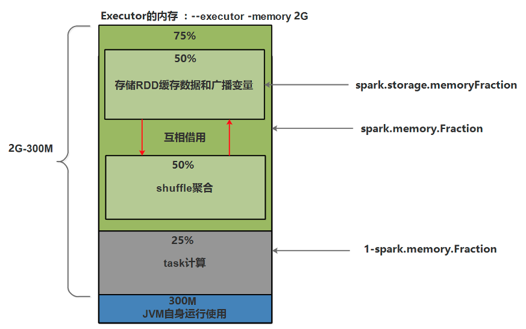
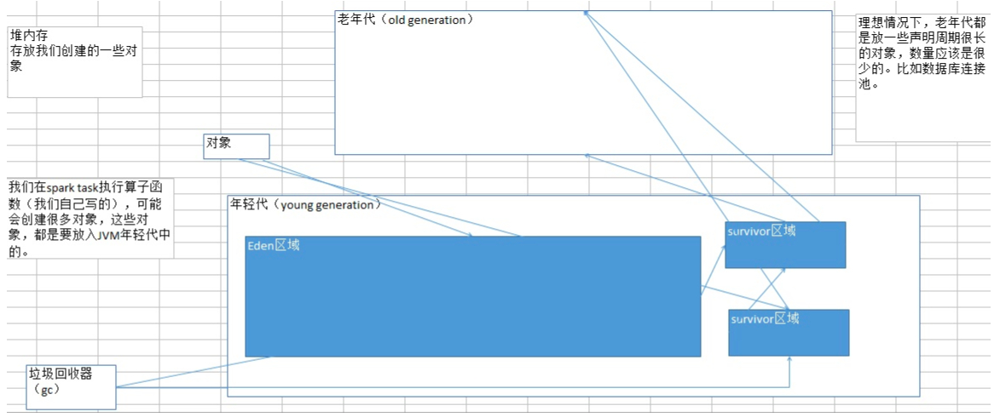
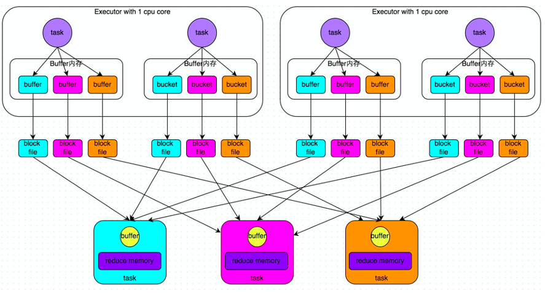
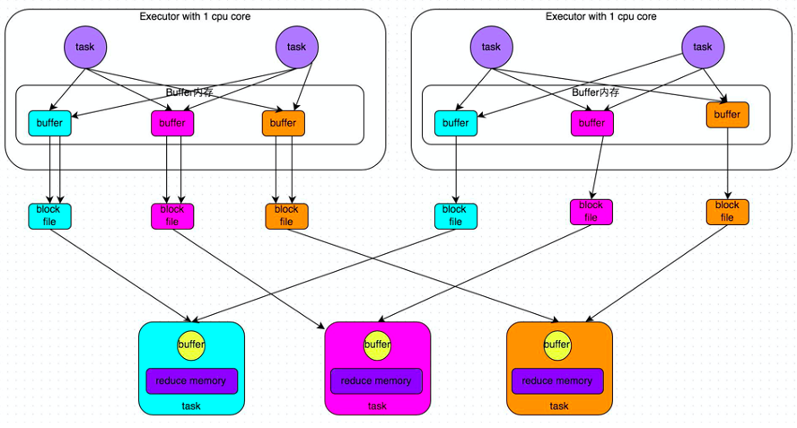
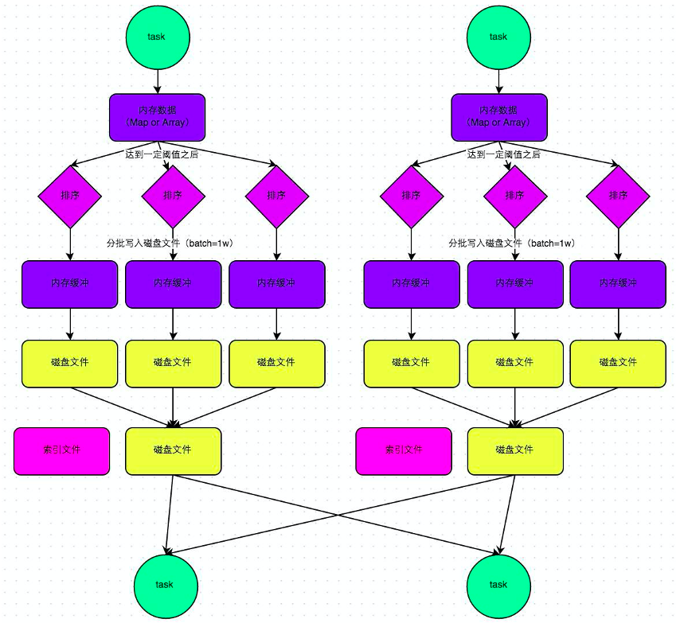
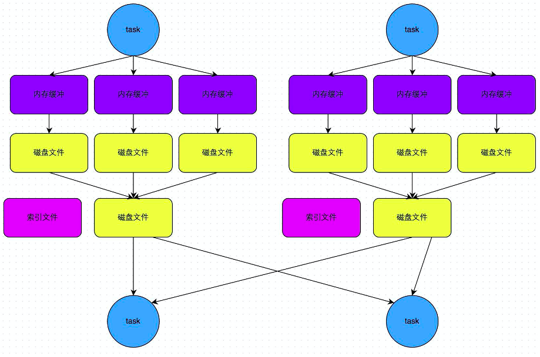

# Spark

## 1 内存优化

**降低cache操作的内存占比**

**JVM原理**

1. 每一次放对象的时候，都是放入eden区域，和其中一个survivor区域；另外一个survivor区域是空闲的。
2. 当eden区域和一个survivor区域放满了以后（spark运行过程中，产生的对象实在太多了），就会触发minor gc，小型垃圾回收。把不再使用的对象，从内存中清空，给后面新创建的对象腾出来点儿地方。
3. 清理掉了不再使用的对象之后，那么也会将存活下来的对象（还要继续使用的），放入之前空闲的那一个survivor区域中。这里可能会出现一个问题。默认eden、survior1和survivor2的内存占比是8: 1 :1。问题是，如果存活下来的对象是1.5，一个survivor区域放不下。此时就可能通过JVM的担保机制（不同JVM版本可能对应的行为），将多余的对象，直接放入老年代了。
4. 如果你的JVM内存不够大的话，可能导致频繁的年轻代内存满溢，频繁的进行minor gc。频繁的minor gc会导致短时间内，有些存活的对象，多次垃圾回收都没有回收掉。会导致这种短声明周期（其实不一定是要长期使用的）对象，年龄过大，垃圾回收次数太多还没有回收到，跑到老年代。
5. 老年代中，可能会因为内存不足，囤积一大堆，短生命周期的，本来应该在年轻代中的，可能马上就要被回收掉的对象。此时，可能导致老年代频繁满溢。频繁进行full gc（全局/全面垃圾回收）。full gc就会去回收老年代中的对象。full gc由于这个算法的设计，是针对的是，老年代中的对象数量很少，满溢进行full gc的频率应该很少，因此采取了不太复杂，但是耗费性能和时间的垃圾回收算法。full gc很慢。
6. full gc / minor gc，无论是快，还是慢，都会导致jvm的工作线程停止工作，stop the world。简而言之，就是说，gc的时候，spark停止工作了。等着垃圾回收结束。
**问题暴露**
1. 频繁minor gc，也会导致频繁spark停止工作
2. 老年代囤积大量活跃对象（短生命周期的对象），导致频繁full gc，full gc时间很长，短则数十秒，长则数分钟，甚至数小时。可能导致spark长时间停止工作。
3. 严重影响咱们的spark的性能和运行的速度。
**优化原理**
1. spark中，堆内存又被划分成了两块儿，一块儿是专门用来给RDD的cache、persist操作进行RDD数据缓存用的；另外一块儿，就是我们刚才所说的，用来给spark算子函数的运行使用的，存放函数中自己创建的对象。
2. 默认情况下，给RDD cache操作的内存占比，是0.6，60%的内存都给了cache操作了。但是问题是，如果某些情况下，cache不是那么的紧张，问题在于task算子函数中创建的对象过多，然后内存又不太大，导致了频繁的minor gc，甚至频繁full gc，导致spark频繁的停止工作。性能影响会很大
3. 针对上述这种情况，大家可以在之前我们讲过的那个spark ui。yarn去运行的话，那么就通过yarn的界面，去查看你的spark作业的运行统计，很简单，大家一层一层点击进去就好。可以看到每个stage的运行情况，包括每个task的运行时间、gc时间等等。如果发现gc太频繁，时间太长。此时就可以适当调价这个比例。
4. 降低cache操作的内存占比，大不了用persist操作，选择将一部分缓存的RDD数据写入磁盘，或者序列化方式，配合Kryo序列化类，减少RDD缓存的内存占用；降低cache操作内存占比；对应的，算子函数的内存占比就提升了。这个时候，可能，就可以减少minor gc的频率，同时减少full gc的频率。对性能的提升是有一定的帮助的。一句话，让task执行算子函数时，有更多的内存可以使用。

## 2 Shuffle

### 2.1 普通的HashShuffle

上图中，每个节点启动一个Executor来运行Application，每个Executor使用1个core，其中有2条task，所以2条task不是并行执行的。Map task每计算一条数据之后，就写到对应的buffer（默认32K）中（比如key为hello的写入到蓝色buffer，key为world的写入到紫色buffer中），当buffer到达阈值后，把其中的数据溢写到磁盘，当task0执行完后，task2开始执行，在这个过程中，每一个map task产生reduce的个数个小文件，假如总共有m个map task，r个reduce，最终会产生m*r个小文件，磁盘小文件和缓存过多，造成耗时且低效的IO操作，可能造成OOM
优化的HashShuffle

每个map task 之间可以共享buffer，task0执行完成后，task1开始执行，继续使用task0使用的buffer，假如总共有c个core， r个reduce，最终会产生c*r个小文件，因为复用buffer后，每个core执行的所有map task产生r个小文件

### 2.2 普通的SortShuffle

1. 每个maptask将计算结果写入内存数据结构中，这个内存默认大小为5M
2. 会有一个“监控器”来不定时的检查这个内存的大小，如果写满了5M，比如达到了5.01M，那么再给这个内存申请5.02M（5.01M * 2 – 5M = 5.02）的内存，此时这个内存空间的总大小为10.02M
3. 当“定时器”再次发现数据已经写满了，大小10.05M，会再次给它申请内存，大小为 10.05M * 2 – 10.02M = 10.08M
4. 假如此时总的内存只剩下5M，不足以再给这个内存分配10.08M，那么这个内存会被锁起来，把里面的数据按照相同的key为一组，进行排序后，分别写到不同的缓存中，然后溢写到不同的小文件中，而map task产生的新的计算结果会写入总内存剩余的5M中
5. buffer中的数据（已经排好序）溢写的时候，会分批溢写，默认一次溢写10000条数据，假如最后一部分数据不足10000条，那么剩下多少条就一次性溢写多少条
6. 每个map task产生的小文件，最终合并成一个大文件来让reduce拉取数据，合成大文件的同时也会生成这个大文件的索引文件，里面记录着分区信息和偏移量（比如：key为hello的数据在第5个字节到第8097个字节）
7. 最终产生的小文件数为2*m（map task的数量）
### 2.3 SortShuffle的bypass机制

有条件的sort，当shuffle reduce task数量小于spark.shuffle.sort.bypassMergeThreshold参数的值（默认200）时，会触发bypass机制，不进行sort，假如目前有300个reduce task，如果要触发bypass机制，就就设置spark.shuffle.sort.bypassMergeThreshold的值大于300，bypass机制最终产生2*m（map task的数量）的小文件。

### 2.4 SparkShuffle详解
**MapOutputTracker：管理磁盘小文件的地址**
- 主：MapOutputTrackerMaster
- 从：MapOutputTrackerWorker
**BlockManager**
- 主：BlockManagerMaster，存在于Driver端,管理范围：
1) RDD的缓存数据 
2) 广播变量 
3) shuffle过程产生的磁盘小文件 

包含4个重要对象： 
1) ConnectionManager：负责连接其他的BlockManagerSlave 
2) BlockTransforService：负责数据传输 
3) DiskStore：负责磁盘管理 
4) Memstore：负责内存管理 
- 从：BlockManagerSlave
存在于Executor端,包含4个重要对象： 
1) ConnectionManager：负责连接其他的BlockManagerSlave 
2) BlockTransforService：负责数据传输 
3) DiskStore：负责磁盘管理 
4) Memstore：负责内存管理 

### 2.5 Shuffle调优
**spark.shuffle.file.buffer**
- 默认值：32K
- 参数说明：该参数用于设置shuffle write task的BufferedOutputStream的buffer缓冲大小。将数据写到磁盘文件之前，会先写入buffer缓冲中，待缓冲写满之后，才会溢写到磁盘。
- 调优建议：如果作业可用的内存资源较为充足的话，可以适当增加这个参数的大小（比如64k），从而减少shuffle write过程中溢写磁盘文件的次数，也就可以减少磁盘IO次数，进而提升性能。在实践中发现，合理调节该参数，性能会有1%~5%的提升。
**spark.reducer.maxSizeInFlight**
- 默认值：48M
- 参数说明：该参数用于设置shuffle read task的buffer缓冲大小，而这个buffer缓冲决定了每次能够拉取多少数据。
- 调优建议：如果作业可用的内存资源较为充足的话，可以适当增加这个参数的大小（比如96M），从而减少拉取数据的次数，也就可以减少网络传输的次数，进而提升性能。在实践中发现，合理调节该参数，性能会有1%~5%的提升。
**spark.shuffle.io.maxRetries**
- 默认值：3
- 参数说明：shuffle read task从shuffle write task所在节点拉取属于自己的数据时，如果因为网络异常导致拉取失败，是会自动进行重试的。该参数就代表了可以重试的最大次数。如果在指定次数之内拉取还是没有成功，就可能会导致作业执行失败。
- 调优建议：对于那些包含了特别耗时的shuffle操作的作业，建议增加重试最大次数（比如60次），以避免由于JVM的full gc或者网络不稳定等因素导致的数据拉取失败。在实践中发现，对于针对超大数据量（数十亿~上百亿）的shuffle过程，调节该参数可以大幅度提升稳定性。
**spark.shuffle.io.retryWait**
- 默认值：5s
- 参数说明：具体解释同上，该参数代表了每次重试拉取数据的等待间隔，默认是5s。
- 调优建议：建议加大间隔时长（比如60s），以增加shuffle操作的稳定性。
**spark.shuffle.memoryFraction**
- 默认值：0.2
- 参数说明：该参数代表了Executor内存中，分配给shuffle read task进行聚合操作的内存比例，默认是20%。
- 调优建议：在资源参数调优中讲解过这个参数。如果内存充足，而且很少使用持久化操作，建议调高这个比例，给shuffle read的聚合操作更多内存，以避免由于内存不足导致聚合过程中频繁读写磁盘。在实践中发现，合理调节该参数可以将性能提升10%左右。
**spark.shuffle.manager**
- 默认值：sort
- 参数说明：该参数用于设置ShuffleManager的类型。Spark 1.5以后，有三个可选项：hash、sort和tungsten-sort。HashShuffleManager是Spark 1.2以前的默认选项，但是Spark 1.2以及之后的版本默认都是SortShuffleManager了。tungsten-sort与sort类似，但是使用了tungsten计划中的堆外内存管理机制，内存使用效率更高。
- 调优建议：由于SortShuffleManager默认会对数据进行排序，因此如果你的业务逻辑中需要该排序机制的话，则使用默认的SortShuffleManager就可以；而如果你的业务逻辑不需要对数据进行排序，那么建议参考后面的几个参数调优，通过bypass机制或优化的HashShuffleManager来避免排序操作，同时提供较好的磁盘读写性能。这里要注意的是，tungsten-sort要慎用，因为之前发现了一些相应的bug。
**spark.shuffle.sort.bypassMergeThreshold**
- 默认值：200
- 参数说明：当ShuffleManager为SortShuffleManager时，如果shuffle read task的数量小于这个阈值（默认是200），则shuffle write过程中不会进行排序操作，而是直接按照未经优化的HashShuffleManager的方式去写数据，但是最后会将每个task产生的所有临时磁盘文件都合并成一个文件，并会创建单独的索引文件。
- 调优建议：当你使用SortShuffleManager时，如果的确不需要排序操作，那么建议将这个参数调大一些，大于shuffle read task的数量。那么此时就会自动启用bypass机制，map-side就不会进行排序了，减少了排序的性能开销。但是这种方式下，依然会产生大量的磁盘文件，因此shuffle write性能有待提高。
**spark.shuffle.consolidateFiles**
- 默认值：false
- 参数说明：如果使用HashShuffleManager，该参数有效。如果设置为true，那么就会开启consolidate机制，会大幅度合并shuffle write的输出文件，对于shuffle read task数量特别多的情况下，这种方法可以极大地减少磁盘IO开销，提升性能。
- 调优建议：如果的确不需要SortShuffleManager的排序机制，那么除了使用bypass机制，还可以尝试将spark.shffle.manager参数手动指定为hash，使用HashShuffleManager，同时开启consolidate机制。在实践中尝试过，发现其性能比开启了bypass机制的SortShuffleManager要高出10%~30%。

配置这些参数有两种方式
1. 在程序中硬编码
例如sparkConf.set("spark.shuffle.file.buffer","64k")
2. 提交application时在命令行指定
例如spark-submit --conf spark.shuffle.file.buffer=64k --conf 配置信息=配置值 ...
3. 修改SPARK_HOME/conf/spark-default.conf配置文件
推荐使用第2种方式