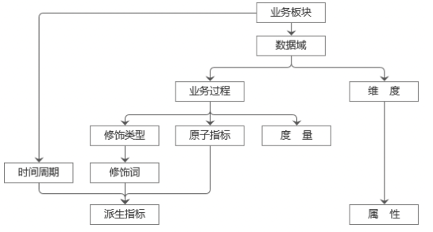
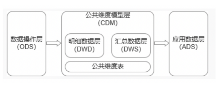
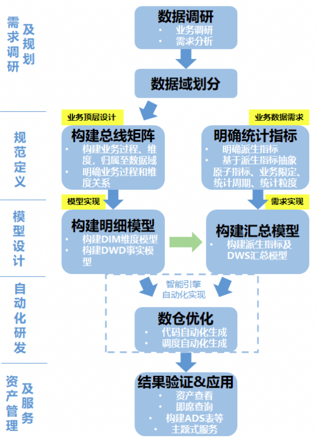
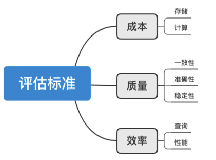
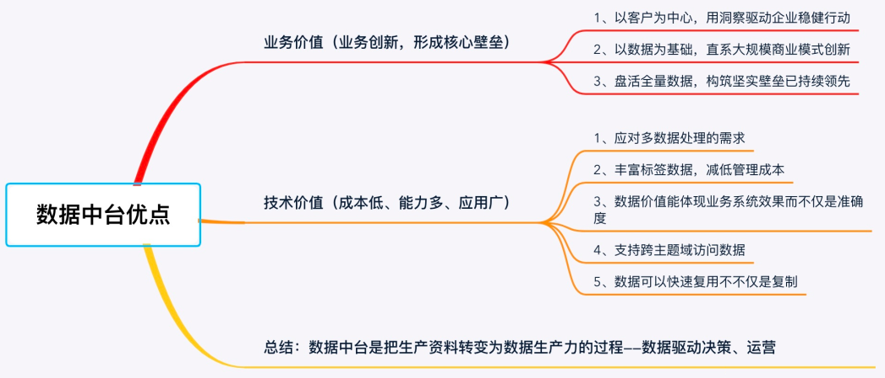

# 维度建模

## 1 简介
维度建模，是数据仓库大师Ralph Kimball提出的，是数据仓库工程领域最流行的数仓建模经典。 
维度建模以分析决策的需求出发构建模型，构建的数据模型为分析需求服务，因此它重点解决用户如何更快速完成分析需求，同时还有较好的大规模复杂查询的响应性能。 
它是面向分析的，为了提高查询性能可以增加数据冗余，反规范化的设计技术。 

## 2 事实表
事实表产生于业务过程，存储了业务活动或事件提炼出来的性能度量。从最低的粒度级别来看，事实表行对应一个度量事件。 
粒度：用于确定某一事实表中的行表示什么，是业务最小活动单元或不同维度组合，即业务细节程度。 
事实表除了包含度量事实外，还包含外健，例如： 
维度外健1、维度外健2、维度外健3、度量事实1、度量事实2 
所有维度外健确定一条数据，所以事实表可以没有单一主键 
针对事实表的查询统计一般以维度外健关联维度做过滤，然后按维度聚合，度量事实统计计算结果
- 可加、半可加、不可加事实 
可加事实指可以按照任意维度汇总的事实 
半可加事实指只能按照部分维度汇总的事实 
不可加事实指完全不能按照维度汇总的事实 
- 空值 
针对度量事实统计的组函数（count、sum、min）可以对空值计算，所以度量事实可以存在空值，而维度外健不能存在空值，否则会存在关联不到的维度，不是一个完整的业务过程 

事实表根据粒度的角色划分不同，可分为事务事实表、周期快照事实表、累积快照事实表。 
- 事务事实表，用于承载事务数据，通常粒度比较低，它是面向事务的，其粒度是每一行对应一个事务，它是最细粒度的事实表，例如产品交易事务事实、ATM交易事务事实。
- 周期快照事实表，按照一定的时间周期间隔(每天，每月)来捕捉业务活动的执行情况，一旦装入事实表就不会再去更新，它是事务事实表的补充。用来记录有规律的、固定时间间隔的业务累计数据，通常粒度比较高，例如账户月平均余额事实表。
- 累积快照事实表，用来记录具有时间跨度的业务处理过程的整个过程的信息，每个生命周期一行，通常这类事实表比较少见。例如一笔订单，从下单、付款、发货、收货、完成，每个流程步骤是可预测的，业务方可能对每个步骤完成时间感兴趣，例如财务可能更关心一笔订单真正的完成时间，即入账时间，这些记录在一个事实表中就是累积快照事实表。
- 无事实事实表，不含度量数字的事实表，例如商品状态事实表，只展示商品的上下架状态，没有可计算的事实数据
注意：这里需要值得注意的是，在事实表的设计时，一定要注意一个事实表只能有一个粒度，不能将不同粒度的事实建立在同一张事实表中。 

## 3 纬度表
维度表，一致性维度，业务过程的发生或分析角度，我们主要关注下退化维度和缓慢变化维。 
- 主键 
自然主键：主键本身具有一定含义，例如学号、身份证号 
代理主键：主键本身没有意义，例如自增id 
数仓工具箱中认为，自然主键不受数仓控制，例如工号，一个员工离职后又入职，在操作型系统中有了新的工号，但是数据仓库希望员工建立单一键，所以建议使用代理键，来作为数据仓库和操作型系统的缓冲，不受业务变动的影响 
但是，数据仓库发展到现在，hive等工具很多不在带有自增主键功能，而且很多操作性系统自身使用的就是代理键，在数仓中可以直接使用，对于特殊情况可以单独处理，维度表的主键是自然主键还是代理主键可以根据实际情况灵活决定
- 退化维度（DegenerateDimension） 
在维度类型中，有一种重要的维度称作为退化维度，亦维度退化一说。这种维度指的是直接把一些简单的维度放在事实表中。退化维度是维度建模领域中的一个非常重要的概念，它对理解维度建模有着非常重要的作用，退化维度一般在分析中可以用来做分组使用。 
- 缓慢变化维（Slowly Changing Dimensions） 
维度的属性并不是始终不变的，它会随着时间的流逝发生缓慢的变化，这种随时间发生变化的维度我们一般称之为缓慢变化维（SCD）。 
SCD常用的三种处理方式 
① TYPE1 直接覆盖原值 
 
② TYPE2 增加维度行 
在为维度成员增加新行时，需为其分配新的主代理键。并且，至少需要在维度行再增加三列：有效日期、截止日期、行标识。这个地方可联想拉链表设计。 
 
③ TYPE3 增加属性列 
 
④ 混合方式 
可根据实际业务场景，混合或选择使用以上三种方式，以快速方便而又准确的分析历史变化情况。
- 一致性维度 
维度建模最重要的特性就是一致性维度，当不同的维度表的属性具有相同列名和领域内容时，称维度表具有一致性，利用一致性维度与每个事实表关联，可将来自不同事实表的信息合并到同一报表中。

## 4 基础概念
 
- 业务板块 
业务板块是逻辑空间的定义，是基于业务特征划分的命名空间
- 数据域 
指面向业务分析，将业务过程或者维度进行抽象的集合。其中，业务过程可以概括为一个个不可拆分的行为事件。在业务过程之下，可以定义指标；维度是指度量的环境，如买家下单事件，买家是维度。为保障整个体系的生命力，数据域是需要抽象提炼，并且长期维护和更新的，但不轻易变动。在划分数据域时，既能涵盖当前所有的业务需求，又能在新业务进入时无影响地被包含进已有的数据域中和扩展新的数据域。
- 业务过程 
指企业的业务活动事件，如下单、支付、退款都是业务过程。请注意，业务过程是一个不可拆分的行为事件，通俗地讲，业务过程就是企业活动中的事件。
- 时间周期 
用来明确数据统计的时间范围或者时间点，如最近30天、自然周、截至当日等。
- 修饰类型 
是对修饰词的一种抽象划分。修饰类型从属于某个业务域，如日志域的访问终端类型涵盖无线端、PC端等修饰词。
- 修饰词 
指除了统计维度以外指标的业务场景限定抽象。修饰词隶属于一种修饰类型，如在日志域的访问终端类型下，有修饰词PC端、无线端等。
- 度量/原子指标 
原子指标和度量含义相同，基于某一业务事件行为下的度量，是业务定义中不可再拆分的指标，具有明确业务含义的名词，如支付金额。
- 维度 
维度是度量的环境，用来反映业务的一类属性，这类属性的集合构成一个维度，也可以称为实体对象。维度属于一个数据域，如地理维度（其中包括国家、地区、省以及城市等级别的内容）、时间维度（其中包括年、季、月、周、日等级别的内容）。
- 维度属性 
维度属性隶属于一个维度，如地理维度里面的国家名称、国家ID、省份名称等都属于维度属性。
- 派生指标 
派生指标＝一个原子指标＋多个修饰词（可选）＋时间周期。可以理解为对原子指标业务统计范围的圈定。如原子指标：支付金额，最近l天海外买家支付金额则为派生指标（最近l天为时间周期，海外为修饰词，买家作为维度，而不作为修饰词）

## 5 数仓架构
 
- 操作数据层（ODS） 
把操作系统数据几乎无处理地存放在数据仓库系统中。
a. 同步：结构化数据增量或全量同步到底层存储。
b. 结构化：非结构化（日志）结构化处理并存储至底层存储。
c. 累积历史、清洗：根据数据业务需求及稽核和审计要求保存历史数据、清洗数据。
- 公共维度模型层（CDM） 
存放明细事实数据、维表数据及公共指标汇总数据，其中明细事实数据、维表数据一般根据ODS层数据加工生成；公共指标汇总数据一般根据维表数据和明细事实数据加工生成。CDM层又细分为DWD层和DWS层，分别是明细数据层和汇总数据层，采用维度模型方法作为理论基础，更多地采用一些维度退化手法，将维度退化至事实表中，减少事实表和维表的关联，提高明细数据表的易用性；同时在汇总数据层，加强指标的维度退化，采取更多的宽表化手段构建公共指标数据层，提升公共指标的复用性，减少重复加工。其主要功能如下：
a. 组合相关和相似数据：采用明细宽表，复用关联计算，减少数据扫描。
b. 公共指标统一加工：基于OneData体系构建命名规范、口径一致和算法统一的统计指标，为上层数据产品、应用和服务提供公共指标；建立逻辑汇总宽表。
c. 建立一致性维度：建立一致的数据分析维表，降低数据计算口径、算法不统一的风险。
- 应用数据层（ADS） 
存放数据产品个性化的统计指标数据，根据CDM层与ODS层加工生成。

## 6 开发流程
数据仓库的主题建模思想是： 
1. 面向主题：采用范式模型理论中的主题划分方法对业务数据进行分类。
2. 一致性保证：采用维度模型理论中的总线结构思想，建立统一的一致性维度表和一致性事实表来保证一致性。
3. 数据质量保证：无论范式建模还是维度建模都非常重视数据质量问题，综合使用两个理论中的方法保证数据质量。
4. 效率保证：合理采取维度退化、变化维、增加冗余等方法，保证数据的计算和查询效率。

 

1、数据调研 
- 业务调研
要构建大数据数据仓库，就需要了解各个业务领域、业务线的业务有什么共同点和不同点，以及各个业务线可以细分为哪几个业务模块，每个业务模块具体的业务流程又是怎样的。业务调研是否充分，将会直接决定数据仓库建设是否成功 。
- 需求调研
需求调研的途径有两种：一是根据与分析师、业务运营人员的沟通（邮件、IM）获知需求；二是对报表系统中现有的报表进行研究分析。通过需求调研分析后，就清楚数据要做成什么样的。很多时候，都是由具体的数据需求驱动数据仓库团队去了解业务系统的业务数据，这两者并没有严格的先后顺序。

2、架构设计 
- 数据域划分
数据域是指面向业务分析，将业务过程或者维度进行抽象的集合。业务过程可以概括为一个个不可拆分的行为事件，如下单、支付、退款。为保障整个体系的生命力，数据域需要抽象提炼，并且长期维护和更新，但不轻易变动。在划分数据域时，既能涵盖当前所有的业务需求，又能在新业务进入时无影响地被包含进已有的数据域中或者扩展新的数据域。
- 构建总线矩阵
在进行业务调研和需求调研后，就要构建总线矩阵了。需要做两件事情：明确每个数据域下有哪些业务过程；业务过程与哪些维度相关，并定义每个数据域下的业务过程和维度。

3、规范定义 
规范定义主要定义指标体系，包括原子指标、修饰词、时间周期和派生指标。上面也做了详细说明，此处不做展开。

4、模型定义 
模型设计主要包括维度及属性的规范定义，维表、明细事实表和汇总事实表的模型设计。

5、维度设计 
维度是维度建模的基础和灵魂。在维度建模中，将度量称为"事实"，将环境描述为"维度"，维度是用于分析事实所需要的多样环境。维度所包含的表示维度的列，称为维度属性。维度属性是查询约束条件、分组和报表标签生成的基本来源，是数据易用性的关键。维度的作用一般是查询约束、分类汇总以及排序等。
维度的设计过程就是确定维度属性的过程，如何生成维度属性，以及所生成的维度属性的优劣，决定了维度使用的方便性，成为数据仓库易用性的关键。正如Kimball所说的，数据仓库的能力直接与维度属性的质量和深度成正比。设计步骤：
 - 第一步：选择维度或新建维度
作为维度建模的核心，在企业级数据仓库中必须保证维度的唯一性。以淘宝商品维度为例，有且只允许有一个维度定义。
- 第二步：确定主维表
此处的主维表一般是ODS表，直接与业务系统同步。
- 第三步：确定相关维表
数据仓库是业务源系统的数据整合，不同业务系统或者同一业务系统中的表之间存在关联性。根据对业务的梳理，确定哪些表和主维表存在关联关系，并选择其中的某些表用于生成维度属性
- 第四步：确定维度属性
主要包括两个阶段，其中第一个阶段是从主维表中选择维度属性或生成新的维度属性；第二个阶段是从相关维表中选择维度属性或生成新的维度属性。

6、事实表设计 
事实表作为数据仓库维度建模的核心，紧紧围绕着业务过程来设计，通过获取描述业务过程的度量来表达业务过程，包含了引用的维度和与业务过程有关的度量。
1. 粒度 
事实表中一条记录所表达的业务细节程度被称为粒度。
2. 事实类型 
作为度量业务过程的事实，一般为整型或浮点型的十进制数值，有可加性、半可加性和不可加性三种类型。
3. 事实表类型 
事务事实表、周期快照事实表、累积快照事实表

7、评估标准 

 

>数据展示层，是需要根据用户个性化需求来设计。在稳固的底层模型的支持下，上层展示层更为强调灵活组合，快速响应用户前端交互。经常采用的是“大宽表”的设计，避免关联，加速显示。

## 7 数据仓库与数据平台和数据中台之间的关系
数据中台：数据服务化，服务化的核心是数据模型化和服务组件化，服务化的基础是大数据平台(大数据平台又是从数据仓库发展起来的)。 
数据中台对于业务的价值是“加速从数据到价值的过程，提高企业的响应能力“。
 
数据平台： 
企业级大数据平台实现结构化、半结构化和非结构化数据统一存储计算功能，通过数据封装提供服务功能，提供自助报表工具，面向市场、网络以及企业外部提供服务。 
- 数据采集中心：负责采集多样化数据。
- 数据计算存储中心：负责对数据进行加工、转换和汇总等工作，并将数据加载到不同的存储系统中。
- 开放共享中心：统一数据服务接口。
- 数据管理中心：负责系统数据的元数据、数据质量、数据模型和数据安全管理。
- 运营管控中心：负责系统运行任务的编排、调度，以及设备、平台和应用的全景运维监控视图。
随着平台厂家和应用厂家的分离，应用的凸显，为了实现数据价值，以数据应用为中心构建企业数据模型，为实现内外部应用支撑，又建设了开放共享平台，提供数据服务和Open API服务，为了支持多应用厂家协作开发，又提供了多租户管理，安全管理、数据目录管理。但在构建过程上缺乏标准化，大家看看是不是这就是数据中台的雏形。 

补充： 
数据仓库是企业级的，能为整个企业各个部门的运作提供决策支持； 
而数据集市则是部门级的，一般只能为某个局部范围内的管理人员服务，因此也称之为部门级数据仓库。 
数据湖=懒人数仓 

总结： 
数据仓库实现了企业数据模型的构建，大数据平台解决了海量、实时数据的计算和存储问题，数据中台要解决什么呢？数据如何安全的、快速的、最小权限的、且能够溯源的被探测和快速应用的问题。数据中台不应该被过度的承载平台的计算、存储、加工任务，而是应该放在解决企业逻辑模型的搭建和存储、数据标准的建立、数据目录的梳理、数据安全的界定、数据资产的开放，知识图谱的构建，通过一系列工具、组织、流程、规范，实现数据前台和后台的连接，突破数据局限，为企业提供更灵活、高效、低成本的数据分析挖掘服务，避免企业为满足具体某部门某种数据分析需求而投放大量高成本、重复性的数据开发成本。厚平台，大中台，小前台；没有基础厚实笨重的大数据平台，是不可能构建数据能力强大、功能强大的数据中台的；没有大数据中台，要迅速搭建小快灵的小前台也只是理想化的。我想这才是数据中台的初衷。