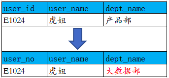
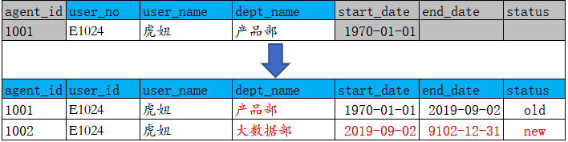
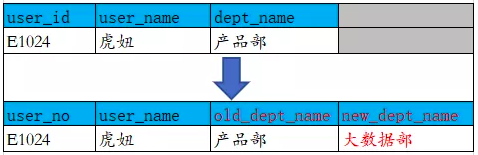

# Spark

## 1 简介
维度建模，是数据仓库大师Ralph Kimball提出的，是数据仓库工程领域最流行的数仓建模经典。 
维度建模以分析决策的需求出发构建模型，构建的数据模型为分析需求服务，因此它重点解决用户如何更快速完成分析需求，同时还有较好的大规模复杂查询的响应性能。 
它是面向分析的，为了提高查询性能可以增加数据冗余，反规范化的设计技术。 

## 2 事实表
事实表产生于业务过程，存储了业务活动或事件提炼出来的性能度量。从最低的粒度级别来看，事实表行对应一个度量事件。 
事实表根据粒度的角色划分不同，可分为事务事实表、周期快照事实表、累积快照事实表。 
粒度：用于确定某一事实表中的行表示什么，是业务最小活动单元或不同维度组合，即业务细节程度。 
- 事务事实表，用于承载事务数据，通常粒度比较低，它是面向事务的，其粒度是每一行对应一个事务，它是最细粒度的事实表，例如产品交易事务事实、ATM交易事务事实。
- 周期快照事实表，按照一定的时间周期间隔(每天，每月)来捕捉业务活动的执行情况，一旦装入事实表就不会再去更新，它是事务事实表的补充。用来记录有规律的、固定时间间隔的业务累计数据，通常粒度比较高，例如账户月平均余额事实表。
- 累积快照事实表，用来记录具有时间跨度的业务处理过程的整个过程的信息，每个生命周期一行，通常这类事实表比较少见。
注意：这里需要值得注意的是，在事实表的设计时，一定要注意一个事实表只能有一个粒度，不能将不同粒度的事实建立在同一张事实表中。 

## 3 纬度表
维度表，一致性维度，业务过程的发生或分析角度，我们主要关注下退化维度和缓慢变化维。 
- 退化维度（DegenerateDimension）
在维度类型中，有一种重要的维度称作为退化维度，亦维度退化一说。这种维度指的是直接把一些简单的维度放在事实表中。退化维度是维度建模领域中的一个非常重要的概念，它对理解维度建模有着非常重要的作用，退化维度一般在分析中可以用来做分组使用。 
- 缓慢变化维（Slowly Changing Dimensions）
维度的属性并不是始终不变的，它会随着时间的流逝发生缓慢的变化，这种随时间发生变化的维度我们一般称之为缓慢变化维（SCD）。 
SCD常用的三种处理方式 
① TYPE1 直接覆盖原值 
 
② TYPE2 增加维度行 
在为维度成员增加新行时，需为其分配新的主代理键。并且，至少需要在维度行再增加三列：有效日期、截止日期、行标识。这个地方可联想拉链表设计。 
 
③ TYPE3 增加属性列 
 
④ 混合方式 
可根据实际业务场景，混合或选择使用以上三种方式，以快速方便而又准确的分析历史变化情况。 