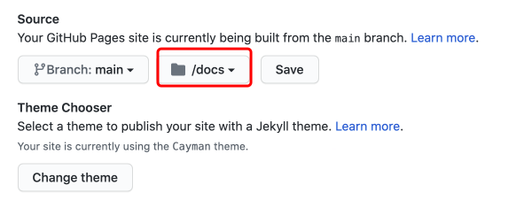

# 博客搭建

> mac环境

## 1 官网下载安装node.js

没啥说的自己百度安装就行了

## 2 docsify安装

## 2.1 找到合适的路径位置

    sudo npm i docsify-cli -g

## 2.2 进入安装部署的文件夹

    docsify init ./docs```<br>

进入docs文件夹

    docsify init ./docs

    open README.md

随便写点什么

    # Headline

    > An awesome project.

    ### hello mxy
退出docs文件夹上一层

    docsify serve docs

本地访问  http://localhost:3000

默认访问README.md页面

新建_sidebar.md

    <!-- docs/_sidebar.md -->

    * [**首页**](/)

    * 大数据
        * [一、Hdfs](bigdata/Hdfs/)
        * [二、MapReduce](bigdata/MapReduce/)
        * [三、Hive](bigdata/Hive/)
        * [四、Spark](bigdata/Spark/)
        * [五、Flink](bigdata/Flink/)
    * 数据仓库
        * [一、维度建模](datawarehouse/dimmodel/)
        * [二、建模流程](datawarehouse/dimdesign/)

上面是我写这片文章时候的目录结构，可以参考自己设计自己的目录，或者参考官方文档

## 3 部署
gihub先申请一个仓库 <br>
仓库名字是 : 你的github用户名.github.io
setting找到 左边 page 选择主题 然后点击提交 Commit changes

    ssh-keygen -t -rsa
    创建密钥
    上传到GitHub

然后本地clone项目，把刚才的docs文件放进去，然后提交项目<br>
在项目设置的page中设置分支<br>
<br>

